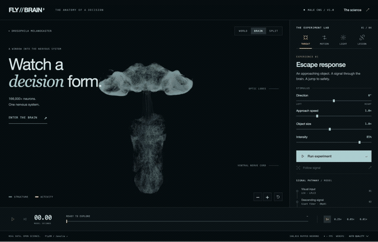
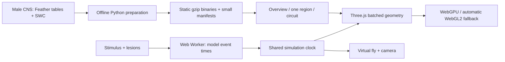

# FLY//BRAIN

**Watch a decision form.** An interactive view of the fruit fly nervous system,
with real Male CNS anatomy and an explicitly illustrative activity model.

**RUNS ENTIRELY IN THE BROWSER. NO BACKEND. NO GPU SERVER.**

[Open the experience](https://xhoxe2.github.io/fly-brain/) ·
[Scientific data](https://male-cns.janelia.org/download/) ·
[Architecture](docs/architecture.md)



## Explore

- **Threat:** approaching object → LC4/LPLC2 → giant fiber → jump motor neuron.
- **Motion / Light:** exploratory visual-input variations on the same prepared subgraph.
- **Lesion:** disable visual, descending or motor neurons; replay intact and disabled conditions.
- **World / Brain / Split:** one clock keeps activity and virtual behavior synchronized.
- **Follow signal:** a camera follows a path through real skeleton geometry and returns to the fly at motor output.
- Pause, scrub, slow to 0.01×, inspect circuit neurons and highlight up to 12 measured partners.

Drag to orbit; scroll or use +/− to zoom. The focused brain viewport also accepts
arrow keys. Enter starts an experiment and Space toggles playback, except while
using another control. Automatic camera movement respects reduced-motion settings.

## Start locally

Node.js 24 or newer. Prepared data is included; Python and scientific API accounts
are **not** needed to run the site.

```sh
npm ci
npm run dev
```

```sh
npm test
npm run build
npm run preview
```

Serve `dist/` as a static site. GitHub Pages deployment is included in
`.github/workflows/pages.yml`. Cloudflare Pages can use `npm run build` and output
directory `dist`, with Node 24. For a subdirectory, run
`npm run build -- --base=/your-path/`.

## What is real?

The dataset is **Male CNS v1.0**, released by FlyEM / HHMI Janelia, University of
Cambridge, MRC LMB and Google Research, under [CC BY 4.0](public/brain/ATTRIBUTION.md).

| Layer          | Included data                                                                            |
| -------------- | ---------------------------------------------------------------------------------------- |
| Overview       | 140,024 real soma coordinates from the 165,122 annotations marked `Traced`               |
| Background     | 72 representative neuron skeletons                                                       |
| Region detail  | Up to 64 representative skeletons per anatomical group, loaded on demand                 |
| Escape circuit | 36 neurons, their fine skeleton geometry, and 250 measured directed chemical connections |

25,098 traced annotations have no soma coordinate and are omitted from the point
overview. We do not invent positions for them. Regional groups are derived from
annotation superclasses, not a complete segmented neuropil atlas. Detailed
morphology is a sample, not every neuron in the CNS.

The model uses earliest-arrival propagation along measured connections with at
least five chemical synapses. Delay, positive transmission, sensory drive,
within-skeleton pulse direction, and the fly's animation are assumptions. It does
not model inhibitory signs, electrical synapses, ion channels or biomechanics.
Playback seconds are **model seconds**, not measured biological latency.

Motion and light are not independently validated motion/phototaxis circuits.
A lesion blocks output in this selected model; it is not a claim that a real fly
would lose every escape response. Camera transitions between neurons are
schematic because synapse positions are not loaded. The in-app **The science**
panel makes these distinctions visible.

## Architecture



TypeScript, Vite and Three.js. Native HTML controls and CSS; no UI framework,
physics engine, WASM runtime or server. Python uses NumPy and PyArrow only.

## Performance

The first milestone was a 166,700-point **synthetic** benchmark, before visual
effects. Real anatomy replaced it after this check passed.

Measured on **Apple M4 Pro, 24 GiB**, a foreground Chrome window at 1392 × 892,
on 2026-09-23. These results describe this machine, not a guarantee for laptops
or phones.

| Workload                               | Observed FPS | CPU submission | Draw calls |
| -------------------------------------- | -----------: | -------------: | ---------: |
| Synthetic 166,700 points, WebGPU       |         ~120 |       ~0.42 ms |          2 |
| Real overview + escape circuit, WebGPU |         ~120 |       ~0.41 ms |          4 |
| Split view + fly, WebGPU               |         ~120 |       ~0.65 ms |         20 |
| Split + regional detail, WebGL2, high  |  119.9–120.1 |   0.30–0.53 ms |         21 |

The last row contains five consecutive one-second samples: p95 frame interval
9.1–9.3 ms, GPU timer 1.26–2.15 ms, 140,024 points and 260,781 line segments.
GPU timings are asynchronous samples and availability depends on the backend.

The overview geometry transfer is **3.23 MB** compressed. The application bundle
is approximately **263 KB gzip** plus 5 KB CSS. The escape skeleton adds 463 KB
when an experiment is opened. All prepared scientific assets total about **8 MB**;
unvisited regional geometry is not downloaded.

The design budgets are 60 FPS on a capable desktop and 30 FPS on medium hardware:

- One point buffer; batched background and circuit lines; no Object3D per neuron.
- GPU node shader moves pulses from time and precomputed distance attributes.
- Worker calculates graph timing once per run and transfers event buffers.
- Quality calibration adjusts pixel ratio and background density. Sustained slow
  frames lower quality; a manual setting disables automatic changes.
- Only one regional detail buffer is retained; replacing it disposes GPU geometry.
- Hidden tabs stop drawing and freeze the experiment clock.
- Click the live FPS indicator for CPU, GPU, primitives and memory diagnostics.
  Prepared-buffer bytes and renderer-tracked GPU bytes are not total VRAM.

Use `/?webgl=1` to force fallback and `/?benchmark=1` for the synthetic benchmark.

## Rebuild scientific assets

The included exports are sufficient for normal development. Regeneration was
verified with Python 3.14. It downloads the ~1 GB connection table, ~14 MB
annotation table and selected skeletons into ignored `.cache/`; these originals
are neither committed nor published.

```sh
python3 -m venv .venv
.venv/bin/pip install -r tools/data-processing/requirements.txt
.venv/bin/python tools/data-processing/prepare.py --check
.venv/bin/python tools/data-processing/prepare.py
npm test
```

The scan processes Arrow record batches to bound memory. SWC simplification
preserves branch points and endpoints. Exports retain original body IDs and
record SHA-256 hashes; see [binary layout](docs/architecture.md).

## Validation and current limits

`npm test` checks the real circuit's causal path, deterministic timing, lesions,
zero-intensity input, directional differences, input validation and every binary
geometry export. The Python self-check covers branch preservation, path distance
and coordinate conversion.

Browser checks passed in Chrome WebGPU, forced Chrome WebGL2, WebKit 26.6 and
Chrome with an iPhone 15 viewport. They cover all four experiments, pause,
inspector, partner filters, region disposal, follow-camera return, comparison
playback, quality invariance and the science dialog. Mobile emulation verifies
layout and interactions; it is not a real-phone GPU benchmark. Edge and physical
iPhones have not been separately benchmarked.

This is a working interactive prototype. Whole-CNS high-resolution geometry,
complete neuropil segmentation, validated motion/light circuits and a biological
simulation remain outside its scientific claims.
