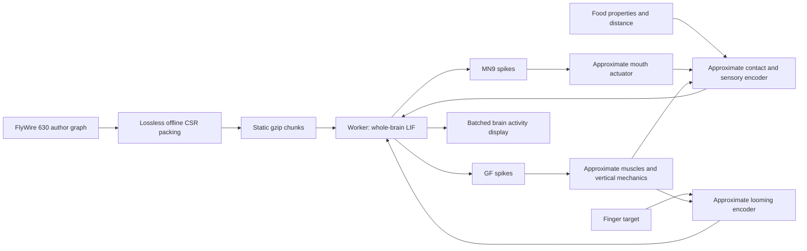

# FLY//BRAIN

A browser simulation of **127,400 fruit-fly neurons**, using the complete signed
FlyWire 630 connectivity supplied with the
[Shiu et al. whole-brain LIF model](https://www.nature.com/articles/s41586-024-07763-9).
Neural activity runs continuously in a Web Worker. No backend, runtime Python,
API credentials or GPU server is required.

## The experiment

Change the food's sugar level, bitterness and distance from the mouth. Contact
drives the author's 21 sugar-sensitive and 21 bitter-sensitive sensory neurons.
The complete recurrent network computes spikes; the two MN9 motor neurons drive
an approximate mouth actuator. Extension changes contact and therefore the next
sensory input. Changing the environment preserves the current neural state.

The fly and brain remain visible together. Brain points flash from computed
spikes. Pause stops simulation progress; reset starts the seeded model again.
The environment controls do not select a predetermined response or replay a
stored animation.

On loading, a short introduction presents sweet food, adds bitterness, then
removes it. Each stage runs for eight visible, unpaused seconds and at least one
computed model second; slow devices may take longer than the usual 24 seconds.
Only the food conditions change. The brain is never reset between stages or on
replay. **Take control** or moving any food slider stops the introduction;
pause freezes both the introduction and neural computation. The mouth caption
and extension gauge always describe the computed actuator state, not the step's
expected outcome. The transparent drop keeps the articulated mouth visible.

The contact model, concentration-to-input-rate mapping and MN9-to-mouth mapping
are **authored approximations**, not published whole-animal biomechanics. This
experiment does not provide autonomous walking, food navigation, learning or a
general animal controller. Food outside the modeled contact range supplies no
taste input; the fly does not walk toward it.

**Add a finger** enables an approaching object in the same scene. Drag its handle
(arrow keys also work), or set side and distance. **Bring closer / Move away**
changes only its target. The finger moves at 1.5 scene units per model second;
the worker and renderer share its actual position. Pausing stops both.
An authored looming-feature encoder converts positive angular expansion into
input to 104 LC4 and 210 LPLC2 visual neurons. The unchanged full network computes
bilateral GF/DNp01 activity, displayed as firing rates. These readouts are never
directly stimulated. Their actual spike counts accumulate into bounded muscle
activation, with sustained firing holding contraction rather than restarting
each stroke. A spring/ground-reaction model produces vertical motion and damps
landing rebound: movement follows its forces and gravity,
without a jump command or recorded movement. Body height changes mouth contact
and the eyes' relative view of the finger, closing both feedback loops.

This is **not full retinal vision, touch sensing, or a complete escape circuit**.
The population-wide input bypasses retinal processing and individual receptive
fields. Its 0–100 Hz gains are not calibrated biological firing rates. New looming
drive requires increasing angular size relative to the moving eyes: a stationary
finger can therefore stimulate the descending body. Residual neural and muscle
activity also persists after input stops.

The GF-to-muscle adapter **bypasses absent thoracic/VNC motor neurons**. It uses
10 ms spike-count bins and 1 ms mechanical steps with authored scene-unit
parameters, slower than biological takeoff. It does not reproduce the precise
GF spike-timing mechanism studied by
[von Reyn et al. (2014)](https://www.nature.com/articles/nn.3741).
There is no GF steering, flight controller or wingbeat animation; wings stay
folded. A computed vertical hop is not evidence of intention or completed flight.
The approximate fingertip shape, eye weights and trajectory are explicit in
`src/finger.ts`; exact cell IDs and primary references are in
[finger protocol](public/dynamics/finger.json). The finger illustration derives
from the CC0 MakeHuman base mesh; see [finger attribution](public/finger/NOTICE).

## Start locally

Node.js 24 or newer. Prepared assets are included; Python is only needed to
regenerate or independently check the scientific data.

```sh
npm ci
npm run dev
```

```sh
npm test
npm run test:feeding
npm run test:finger
npm run build
npm run preview
```

Serve `dist/` as a static site. Cloudflare Pages deployment is configured in
`wrangler.jsonc`; GitHub runs tests and a production build on every push or pull
request. To publish an update using an authenticated Cloudflare account:

```sh
npm run build
npx --yes wrangler@4.138.0 pages deploy dist --project-name fly-brain --branch main
```

Deployments are uploaded explicitly; pushing to GitHub alone does not deploy.
An earlier production deployment can be restored from Cloudflare Pages' deployment
history. For a subdirectory, build with
`npm run build -- --base=/your-path/`. Hosts must serve the included gzip assets;
the loader also accepts responses already decoded through `Content-Encoding`.

## Scientific data and limits

| Active layer | Included data |
| --- | --- |
| Neural model | All 127,400 neurons in the author's FlyWire 630 completeness table |
| Connectivity | All 14,687,178 directed connections; 52,793,639 underlying synapse counts |
| Signs | 8,800,532 excitatory and 5,886,646 inhibitory connections, exactly as supplied |
| Brain display | 127,322 source neuron anchors, joined by exact FlyWire 630 ID |
| Feeding interface | 21 sugar GRNs, 21 bitter GRNs, MN9 left and right from the author notebook |

The 78 neurons without a matching anchor remain simulated and are omitted only
from rendering. Anchors usually lie on a neuron's backbone; they are **not all
somata**, whole-neuron skeletons or synapse locations. No Male CNS coordinates
are substituted. IDs remain exact uint64 values or decimal strings.

Two published anchor rows are extreme coordinate outliers. Initial camera
framing uses padded robust bounds; their source values are retained, with no
guessed repair or remapping.

The numerical core follows the author's homogeneous leaky integrate-and-fire
equations: 0.1 ms steps, 20 ms membrane and 5 ms synaptic time constants, 1.8 ms
synaptic delay, 2.2 ms refractory period and 0.275 mV per signed synapse count.
Stimulated cells receive independent Poisson voltage inputs and have no
refractory period, as in the reference. Every supplied connection is retained;
there is no minimum-weight cutoff or sampled simulation subgraph.

These parameters and neurotransmitter signs are model assumptions, not measured
electrophysiology for each cell. Electrical synapses, plasticity and individual
ion channels are not simulated. Seeded runs are reproducible within this
implementation; its random stream is not NumPy's. The paper's sugar/bitter
experiment supplies neural inputs and MN9 readouts, not the added continuous
contact/body feedback or a calibrated prediction of biological firing rates.

Sources and licenses:

- [Author model and data](https://github.com/philshiu/Drosophila_brain_model/tree/91bdd1e7dcf193f3e7ca5a8933497fcef63b7960), MIT: [license](public/dynamics/MODEL-LICENSE).
- [FlyWire 630 annotations, v1.1.0](https://github.com/flyconnectome/flywire_annotations/tree/df6bb136f5b3d91c3992df4e8de2642329e2a384), Schlegel et al.; [dataset release](https://zenodo.org/records/8077335), CC BY 4.0.
- [Prepared provenance and source hashes](public/dynamics/provenance.json), [feeding protocol](public/dynamics/feeding.json).

The anatomical fly uses separate adult-female NeuroMechFly micro-CT surfaces
and its articulated rig, under Apache 2.0. It is not the FlyWire brain specimen.
The prepared GLB contains 103,369 triangles in **30 meshes**, occupying
**2,464,636 bytes**. Pigmentation, bristles, eye facets and the motor-to-joint
mapping are illustrative additions. See [fly attribution](public/fly/NOTICE).

## Architecture and performance



TypeScript, Vite and Three.js; WebGPU with WebGL2 fallback. One point buffer
represents the visible brain. There is no Object3D per neuron. The worker owns
the full network and transfers compact activity updates; rendering quality does
not change the graph or numerical timestep.

This full model intentionally exceeds the earlier sub-5 MB data budget:

- Neural assets total **51.98 MB** on disk; graph chunks account for **50.31 MB**.
- The graph has 15 compressed chunks, each at most **5.52 MB**, and expands to
  **118.01 MB** before neuronal state and other application memory.
- Anchor coordinates add 1.08 MB compressed; the fly adds 2.46 MB. JavaScript,
  styles and these assets make the complete first load larger than 54 MB.

Fast rendering does not imply real-time neural computation. Loading, simulation
throughput and display FPS are separate costs. The earlier small-circuit FPS
measurements and `docs/demo.gif` describe a retired revision, not this model's
performance. Desktop/browser measurements must be repeated for the full graph;
no physical-phone performance guarantee is made. Details:
[architecture and binary layouts](docs/architecture.md).

Local verification on 2026-09-24: the existing Codex browser was tested at
1392×892 and 390×844. WebGPU at high quality and WebGL2 at low quality reached
about 120 display FPS. With 0.5× requested, observed neural throughput ranged
from about 0.1× to 0.5× during browser checks; display FPS is not the neural
rate. WebGL2 at high quality was slower. A separate 60-second full-network CPU
baseline, before exact fixed-point skipping, took 71.96 wall seconds and retained
finite neuronal state throughout. These are
local observations, not cross-device guarantees. Browser checks covered bitter
suppression, food removal and return, pause, reset, quality and scientific notes.

## Rebuild and verify

Raw originals stay in ignored `.cache/brain-model`. Preparation downloads the
author's 86.6 MB Parquet, 3.1 MB completeness CSV and 21.7 MB annotation table,
checks pinned hashes, then packages every source row without changing its weight.

```sh
python3 -m venv .venv
.venv/bin/pip install -r tools/data-processing/requirements.txt
.venv/bin/python tools/data-processing/prepare_dynamics.py
.venv/bin/python tools/data-processing/prepare_dynamics.py --check
.venv/bin/python tools/data-processing/prepare_fly.py --self-check
python3 tools/data-processing/prepare_finger.py --check
npm test
npm run build
```

The dynamics self-check validates every edge against the cached source, exact
IDs, signed counts, chunk hashes and all 44 protocol cells. Neural tests cover
delay, inhibition, refractoriness, reset scheduling, reproducibility and exact
fixed-point skipping against an always-updated dense reference; body
feedback tests check contact, persistent state and the absence of movement
without neural output.

`npm run test:feeding` checks the prepared full graph, then runs continuous
sugar, bitter, recovery and food-removal conditions with no resets between them.
A disconnected control still receives sensory input but must produce no MN9
output or mouth extension. It checks causal behavior in this model, not a fit
to measured feeding behavior.

`npm run test:finger` verifies all 314 visual input identities and both GF
readouts, then runs continuous left/right approaches with the production sensory
and body adapters. A disconnected graph still receives visual stimulation but
must produce no GF output or body takeoff. These checks establish causality in
this implementation, not agreement with measured fly behavior. Looming drive
depends on relative eye/finger geometry, including body motion; a stationary
finger does not imply zero input while the body moves.

For an independent numerical comparison, install the offline reference only:

```sh
.venv/bin/pip install brian2==2.10.1
.venv/bin/python tools/data-processing/check_neural_reference.py
```

Six fixed-input fixtures match Brian2 spike counts exactly, with voltage/current
errors below 2e-10 mV. This checks numerical scheduling and equations on small
graphs; it does not validate whole-animal behavior or reproduce the paper's
full statistical experiment. Browser rendering and interaction checks remain
separate from these numerical tests.

The previous Threat/Motion/Light/Lesion implementation, Male CNS assets and
their preparation tools remain in the repository as **legacy material**. They
are not the active experiment and are not mixed into this FlyWire simulation.
